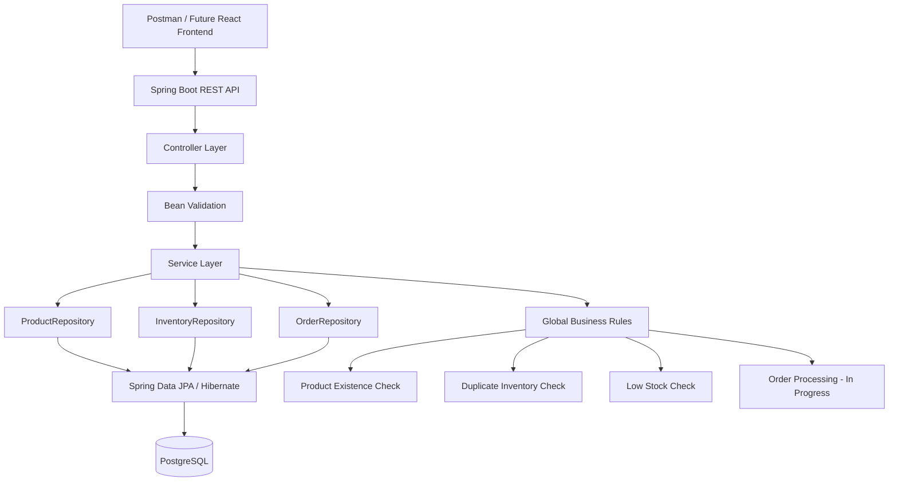

# FreshCart Grocery Order and Inventory Platform

FreshCart is a learning and portfolio backend project built with Java and Spring Boot.

The project currently provides Product, Inventory, and Order management using REST APIs, PostgreSQL, Spring Data JPA/Hibernate, Bean Validation, global exception handling, and Docker-based database infrastructure.

> **Current Status:** Product module complete, Inventory module complete for the current stage, basic Order CRUD complete, and OrderItem / Order-to-Inventory business logic is currently being developed. React frontend, authentication, Redis integration, Kafka, microservices, Kubernetes, CI/CD, and AWS deployment are later phases.

---

## Architecture



### Current Request Flow

```text
Postman / Future React
        |
        v
Controller
        |
        v
@Valid / Bean Validation
        |
        v
Service
        |
        v
Repository
        |
        v
Spring Data JPA / Hibernate
        |
        v
PostgreSQL
```

### Layer Responsibilities

```text
Controller
= Receives HTTP requests

Service
= Contains business logic

Repository
= Performs database operations

Entity
= Represents database data

GlobalExceptionHandler
= Handles common validation errors
```

---

# Technology Stack

- Java 17
- Spring Boot
- Spring Web
- Spring Data JPA
- Hibernate
- Jakarta Bean Validation
- PostgreSQL 17
- Maven
- Docker Desktop
- pgAdmin
- Postman
- IntelliJ IDEA
- Git
- GitHub
- Redis container available for a later phase, but not integrated with the Java application yet

---

# Local Ports

| Component | Port |
|---|---:|
| Spring Boot | 8080 |
| PostgreSQL Host | 5433 |
| PostgreSQL Container | 5432 |
| pgAdmin | 5050 |
| Redis | 6379 |

**Security Note:** Database passwords and other secrets should not be committed to GitHub. Database credentials are supplied to Spring Boot using environment variables.

---

# Product Module

The Product module contains:

- `Product.java` - JPA entity
- `ProductController.java` - REST endpoints
- `ProductService.java` - business logic
- `ProductRepository.java` - Spring Data JPA repository

### Product Fields

- `id`
- `name`
- `description`
- `price`
- `quantity`
- `category`

---

## Product APIs

| Method | Endpoint | Purpose |
|---|---|---|
| POST | `/api/products` | Create Product |
| GET | `/api/products` | Get all Products |
| GET | `/api/products/{id}` | Get Product by ID |
| PUT | `/api/products/{id}` | Update Product |
| DELETE | `/api/products/{id}` | Delete Product |

---

## Product Validation

Implemented and tested:

- Product name is required
- Price must be greater than 0
- Quantity must be greater than 0
- Category is required
- Invalid requests return `400 Bad Request`
- Missing Products return `404 Not Found`
- Validation errors are handled using `GlobalExceptionHandler`

Example:

```json
{
  "name": "Product name is required",
  "price": "Price must be greater than 0",
  "quantity": "Quantity must be greater than 0",
  "category": "Category is required"
}
```

---

# Inventory Module

The Inventory module contains:

- `Inventory.java`
- `InventoryController.java`
- `InventoryService.java`
- `InventoryRepository.java`

### Inventory Fields

- `id`
- `productId`
- `stockQuantity`
- `reorderLevel`

---

## Inventory APIs

| Method | Endpoint | Purpose |
|---|---|---|
| POST | `/api/inventory` | Create Inventory |
| GET | `/api/inventory` | Get all Inventory |
| GET | `/api/inventory/{id}` | Get Inventory by ID |
| PUT | `/api/inventory/{id}` | Update Inventory |
| DELETE | `/api/inventory/{id}` | Delete Inventory |
| GET | `/api/inventory/{id}/low-stock` | Check if one Inventory record is low stock |
| GET | `/api/inventory/low-stock` | Get all low-stock Inventory records |

---

## Inventory Validation

Implemented and tested:

- `productId` must be greater than 0
- `stockQuantity` cannot be negative
- `reorderLevel` cannot be negative
- Invalid requests return `400 Bad Request`
- Missing Inventory records return `404 Not Found`

Example:

```json
{
  "reorderLevel": "Reorder level cannot be negative",
  "stockQuantity": "Stock quantity cannot be negative"
}
```

---

## Product Existence Business Rule

Before Inventory is created, the application checks whether the associated Product exists.

Example:

```text
productId = -2
    |
    v
@Positive validation fails
    |
    v
400 Bad Request
```

But:

```text
productId = 999
    |
    v
999 is positive
    |
    v
Validation passes
    |
    v
ProductRepository.existsById(999)
    |
    v
Product does not exist
    |
    v
404 Not Found
```

This prevents Inventory from being created for a nonexistent Product.

---

## Duplicate Inventory Business Rule

FreshCart prevents multiple Inventory records from being created for the same Product.

Example:

```text
Product ID 2 already has Inventory
        |
        v
POST another Inventory with productId = 2
        |
        v
409 Conflict
        |
        v
"Inventory already exists for this product"
```

---

## Low Stock Business Rule

Inventory is considered low stock when:

```text
stockQuantity <= reorderLevel
```

Example:

```text
Stock Quantity = 5
Reorder Level = 10

5 <= 10
    |
    v
Low Stock = true
```

---

# Order Module

The basic Order module is now implemented.

The module currently contains:

- `Order.java`
- `OrderController.java`
- `OrderService.java`
- `OrderRepository.java`
- `OrderItem.java` - currently being developed

### Current Order Fields

- `id`
- `customerName`
- `totalAmount`
- `status`
- `orderDate`
- `items` - relationship currently being added

---

## Order APIs

| Method | Endpoint | Purpose |
|---|---|---|
| POST | `/api/orders` | Create Order |
| GET | `/api/orders` | Get all Orders |
| GET | `/api/orders/{id}` | Get Order by ID |
| PUT | `/api/orders/{id}` | Update Order |
| DELETE | `/api/orders/{id}` | Delete Order |

---

## Order Functionality Completed

Implemented and tested:

- Create Order
- Automatically generate Order ID
- Automatically set `orderDate`
- Get all Orders
- Get Order by ID
- Update Order
- Delete Order
- Return `404 Not Found` for missing Orders
- Order request validation

Example basic Order:

```json
{
  "customerName": "John",
  "totalAmount": 35.75,
  "status": "CONFIRMED"
}
```

---

# OrderItem - Current Development

The next stage is allowing an Order to contain products.

Current `OrderItem` fields:

- `id`
- `productId`
- `quantity`
- `price`

Planned relationship:

```text
One Order
    |
    +---- OrderItem
    |
    +---- OrderItem
    |
    +---- OrderItem
```

JPA relationship:

```text
Order
@OneToMany
    |
    |
    v
OrderItem
@ManyToOne
```

Example:

```text
Order 10
Customer: John

├── Bread x 2
├── Milk x 1
└── Eggs x 3
```

The Order-to-OrderItem relationship is currently being implemented.

---

# Global Exception Handling

`GlobalExceptionHandler` provides centralized validation error handling.

Instead of putting repeated exception-handling logic in every Controller:

```text
ProductController
InventoryController
OrderController
```

validation errors can be handled from one place.

Flow:

```text
Request
   |
   v
Controller
   |
   v
@Valid
   |
   v
Validation fails
   |
   v
GlobalExceptionHandler
   |
   v
400 Bad Request
```

---

# HTTP Status Codes Used

| Status | Meaning | FreshCart Example |
|---|---|---|
| 200 | Success | GET/PUT request succeeded |
| 400 | Bad Request | Validation failed |
| 404 | Not Found | Product, Inventory, or Order does not exist |
| 405 | Method Not Allowed | HTTP method was not mapped |
| 409 | Conflict | Duplicate Inventory |

---

# Tested Scenarios

## Product

- Create Product successfully
- Get all Products
- Get Product by ID
- Update Product
- Delete Product
- Verify deleted Product returns 404
- Reject invalid Product requests
- Return validation messages
- Return 404 for missing Product

## Inventory

- Create Inventory successfully
- Get all Inventory
- Get Inventory by ID
- Update Inventory
- Delete Inventory
- Verify deleted Inventory returns 404
- Reject negative stock
- Reject negative reorder level
- Reject non-positive Product IDs
- Return 404 for nonexistent Product
- Reject duplicate Inventory with `409 Conflict`
- Check individual low-stock status
- Get all low-stock Inventory records

## Order

- Create Order successfully
- Get all Orders
- Get Order by ID
- Return 404 for nonexistent Order
- Update Order
- Verify updated Order using GET
- Delete Order
- Verify deleted Order returns 404

---

# Troubleshooting Completed During Development

Several real development issues were identified and resolved.

### Java / IntelliJ

- Fixed JDK mismatch
- Configured project to use Java 17

### PostgreSQL / Docker

- Fixed PostgreSQL container connectivity issue
- Configured host port `5433` to container port `5432`
- Resolved PostgreSQL authentication failure
- Verified database credentials directly using `psql`
- Configured database credentials using IntelliJ environment variables

### Spring Boot

- Fixed `ProductRepository` package/import issue
- Fixed incorrect validation annotation placement
- Fixed missing/incorrect Order Repository declaration
- Fixed Order getter/setter issues
- Fixed service-method placement problems
- Fixed controller mappings

### Port 8080 Conflict

A Spring Boot startup error occurred because port `8080` was already being used.

The process was identified using:

```bash
netstat -ano | findstr :8080
```

and stopped using:

```bash
taskkill /PID <PID> /F
```

The application then started successfully.

### 405 Order PUT Issue

A `405 Method Not Allowed` occurred while testing:

```text
PUT /api/orders/{id}
```

The application was still running an older Controller version.

After restarting Spring Boot, the new `@PutMapping` was registered and the endpoint worked successfully.

---

# Current Project Structure

```text
com.mahesh.freshcart
|
|-- FreshcartApplication
|-- GlobalExceptionHandler
|-- ProductRepository
|
|-- product
|   |-- Product
|   |-- ProductController
|   `-- ProductService
|
|-- inventory
|   |-- Inventory
|   |-- InventoryController
|   |-- InventoryRepository
|   `-- InventoryService
|
`-- order
    |-- Order
    |-- OrderController
    |-- OrderRepository
    |-- OrderService
    `-- OrderItem
```

> **Future cleanup:** `ProductRepository` currently exists in `com.mahesh.freshcart`, while the remaining Product classes are under `com.mahesh.freshcart.product`. It can later be moved into the Product package for better organization.

---

# Current Module Status

```text
Product Module                         ✅ Complete

Inventory Module                       ✅ Complete for current stage
├── CRUD                               ✅
├── Validation                         ✅
├── Product existence                  ✅
├── Duplicate Inventory protection     ✅
└── Low-stock logic                    ✅

Order Module
├── Basic CRUD                         ✅
├── Validation                         ✅
├── 404 handling                       ✅
├── Automatic orderDate                ✅
├── OrderItem entity                   🟡 In Progress
└── Order ↔ OrderItem relationship     🟡 In Progress
```

---

# Next Development Steps

The next backend work will be completed in this order:

1. Finish `OrderItem`
2. Complete `OrderItem -> Order` `@ManyToOne` relationship
3. Complete `Order -> OrderItem` `@OneToMany` relationship
4. Add nested OrderItem validation
5. Add Inventory lookup by `productId`
6. Connect `OrderService` with Product and Inventory
7. Validate Product existence while placing an Order
8. Validate Inventory existence
9. Check whether enough stock is available
10. Reject Orders when stock is insufficient
11. Read Product price from the Product table
12. Calculate Order total in the backend
13. Reduce Inventory after successful Order
14. Use `@Transactional` for Order + Inventory consistency
15. Test complete Order flow in Postman
16. Improve Order status handling
17. Introduce DTOs
18. Add CORS for React
19. Perform final backend testing
20. Start React frontend

---

# Planned Future Architecture

```text
User
 |
 v
React Frontend
 |
 v
Spring Boot REST API
 |
 +----------+-----------+
 |          |           |
 v          v           v
Product  Inventory    Order
 |          |           |
 +----------+-----------+
            |
            v
        PostgreSQL
            |
     +------+------+
     |             |
     v             v
   Redis         Kafka
   Cache        Messaging
     |
     v
   Docker
     |
     v
 Kubernetes
     |
     v
    AWS
```

Redis, Kafka, Security, Kubernetes, and AWS are planned phases and are not currently integrated into the application.

---

# Learning Outcomes So Far

FreshCart has provided hands-on practice with:

- Java classes and objects
- Access modifiers
- Getters and setters
- Constructors
- Java `Long`, `String`, `Integer`, `BigDecimal`, and `LocalDateTime`
- Spring Boot
- Dependency Injection
- Constructor Injection
- REST APIs
- HTTP GET, POST, PUT, and DELETE
- `@RestController`
- `@RequestMapping`
- `@RequestBody`
- `@PathVariable`
- `@Valid`
- JPA entities
- Spring Data repositories
- Hibernate
- PostgreSQL
- Bean Validation
- Global exception handling
- HTTP status codes
- Business-rule validation
- Cross-module validation
- Docker containers
- Docker networking
- Port mapping
- Postman testing
- Git and GitHub
- Debugging compile-time, runtime, API, validation, database, and port issues
