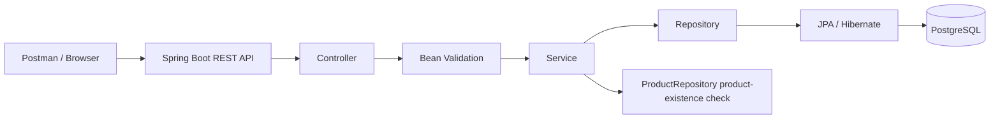

# FreshCart Grocery Order and Inventory Platform

FreshCart is a learning/portfolio backend project built with Java and Spring Boot. The current implementation focuses on Product and Inventory management with REST APIs, PostgreSQL persistence, validation, and error handling.

> Current status: Product module complete; Inventory CRUD and core validation/business-rule checks complete. Frontend, authentication, orders, Redis integration, Kafka, microservices, Kubernetes, and AWS deployment are future phases.

## Architecture



Current request flow:

```text
Postman / Browser
      -> Controller
      -> Validation
      -> Service
      -> Repository
      -> JPA / Hibernate
      -> PostgreSQL
```

## Technology Stack

- Java 17
- Spring Boot
- Spring Web
- Spring Data JPA / Hibernate
- Jakarta Bean Validation
- PostgreSQL 17
- Maven
- Docker Desktop
- pgAdmin
- Postman
- IntelliJ IDEA
- Redis container available for a later phase (not integrated yet)

## Local Ports

| Component | Port |
|---|---:|
| Spring Boot | 8080 |
| PostgreSQL host mapping | 5433 -> container 5432 |
| pgAdmin | 5050 |
| Redis | 6379 |

**Security note:** Do not commit database passwords or other secrets to GitHub. Use environment variables or local-only configuration for credentials.

## Product Module

The Product module is implemented with:

- `Product.java` - JPA entity
- `ProductService.java` - business logic
- `ProductController.java` - REST endpoints
- `ProductRepository.java` - Spring Data JPA repository

Current Product fields:

- `id`
- `name`
- `description`
- `price`
- `quantity`
- `category`

### Product APIs

| Method | Endpoint | Purpose |
|---|---|---|
| POST | `/api/products` | Create a product |
| GET | `/api/products` | Get all products |
| GET | `/api/products/{id}` | Get one product |
| PUT | `/api/products/{id}` | Update a product |
| DELETE | `/api/products/{id}` | Delete a product |

### Product Validation and Error Handling

Implemented and tested:

- Required product name
- Positive price
- Positive quantity
- Required category
- `400 Bad Request` for invalid request data
- `404 Not Found` when a requested product does not exist
- Clean field-level validation responses through `GlobalExceptionHandler`

Example validation response:

```json
{
  "name": "Product name is required",
  "price": "Price must be greater than 0",
  "quantity": "Quantity must be greater than 0",
  "category": "Category is required"
}
```

## Inventory Module

The Inventory module is implemented with:

- `Inventory.java` - JPA entity
- `InventoryRepository.java` - Spring Data JPA repository
- `InventoryService.java` - business logic
- `InventoryController.java` - REST endpoints

Current Inventory fields:

- `id` - inventory record ID
- `productId` - associated Product ID
- `stockQuantity` - current stock
- `reorderLevel` - low-stock threshold

### Inventory APIs

| Method | Endpoint | Purpose |
|---|---|---|
| POST | `/api/inventory` | Create an inventory record |
| GET | `/api/inventory` | Get all inventory records |
| GET | `/api/inventory/{id}` | Get one inventory record |
| PUT | `/api/inventory/{id}` | Update stock/reorder level |
| DELETE | `/api/inventory/{id}` | Delete an inventory record |

### Inventory Validation

Implemented and tested:

- `productId` must be greater than 0
- `stockQuantity` must be zero or greater
- `reorderLevel` must be zero or greater
- Invalid POST/PUT requests return `400 Bad Request`
- Missing Inventory IDs return `404 Not Found`

Example validation response:

```json
{
  "reorderLevel": "Reorder level cannot be negative",
  "stockQuantity": "Stock quantity cannot be negative"
}
```

### Product Existence Business Rule

Inventory creation also checks whether the Product actually exists.

Example:

```text
productId = -2
-> 400 Bad Request (invalid field value)

productId = 999
-> field validation passes because 999 is positive
-> ProductRepository.existsById(999) is checked
-> 404 Not Found if Product 999 does not exist
```

This prevents Inventory from being created for a nonexistent Product.

## Tested Scenarios

- Create Product successfully
- Get all Products
- Get Product by ID
- Update Product and verify persisted changes with GET
- Delete Product and verify missing record
- Reject invalid Product POST/PUT requests
- Return clean Product validation messages
- Return 404 for missing Product
- Create Inventory successfully
- Get all Inventory records
- Get Inventory by ID
- Update Inventory and verify persisted changes with GET
- Delete Inventory and verify 404 afterward
- Reject negative stock quantity and reorder level
- Reject non-positive Product IDs
- Return 404 when Inventory references a Product that does not exist

## Troubleshooting Completed During Development

- Corrected IntelliJ JDK mismatch and aligned the project with Java 17
- Fixed Docker/PostgreSQL connection problems
- Used host port `5433` for PostgreSQL while the container uses `5432`
- Corrected malformed Postman URLs and HTTP methods
- Added request bodies for PUT requests when required
- Fixed Spring endpoint/restart issues
- Replaced empty/null responses with proper 404 handling
- Added global validation error handling
- Corrected `@Positive` placement from Inventory `id` to `productId`
- Fixed `ProductRepository` package/import mismatch in `InventoryService`
- Rebuilt the project successfully after the import fix

## Current Project Structure

```text
com.mahesh.freshcart
|-- FreshcartApplication
|-- GlobalExceptionHandler
|-- ProductRepository
|
|-- product
|   |-- Product
|   |-- ProductController
|   `-- ProductService
|
`-- inventory
    |-- Inventory
    |-- InventoryController
    |-- InventoryRepository
    `-- InventoryService
```

> Cleanup item for a later refactor: `ProductRepository` currently sits in `com.mahesh.freshcart`, while the other Product classes are inside `com.mahesh.freshcart.product`. It can later be moved into the Product package for consistency.

## Current Verified Sample Data

At the latest verified point:

```text
Product ID 2
Name: Bread
Description: Whole Wheat Bread
Price: 2.99
Quantity: 25
Category: Bakery
```

A valid Inventory record was also created for Product ID 2 and used for CRUD/validation testing. Test records created only for error scenarios were cleaned up when identified.

## Next Development Steps

1. Complete final Inventory verification after the Product-existence rule.
2. Add low-stock business logic using `stockQuantity <= reorderLevel`.
3. Decide how Product quantity and Inventory stock should be separated to avoid duplicated stock data.
4. Build Order functionality and update stock when an order is placed.
5. Add security/authentication.
6. Build the React frontend.
7. Integrate Redis caching.
8. Integrate Kafka/event-driven behavior.
9. Containerize the full application and later move toward microservices.
10. Add Kubernetes, CI/CD, and AWS deployment in later phases.

## Learning Outcomes So Far

This project has provided hands-on practice with:

- Java classes, objects, access modifiers, getters/setters, and constructors
- Spring dependency injection
- REST controllers and HTTP methods
- Controller-Service-Repository architecture
- JPA entities and repositories
- PostgreSQL persistence
- Bean Validation
- Global exception handling
- HTTP status codes such as 200, 400, 404, and 405
- Business-rule validation across modules
- Docker networking and port mapping
- Postman API testing
- Debugging compile, runtime, URL, validation, and database issues
